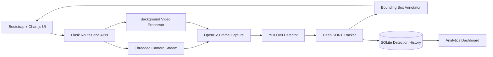
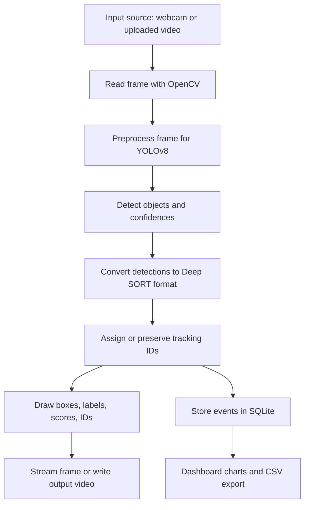
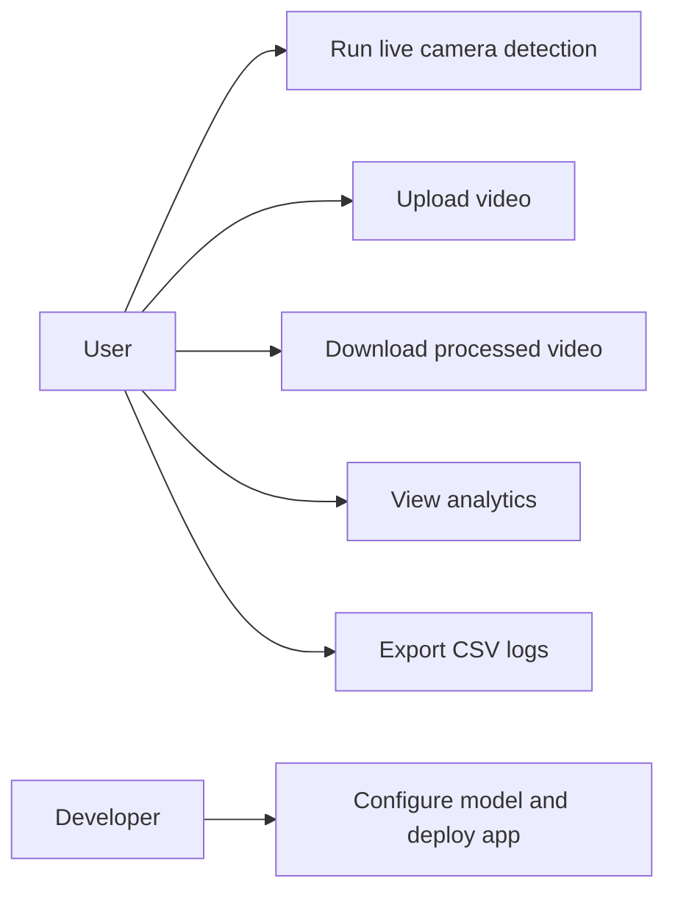
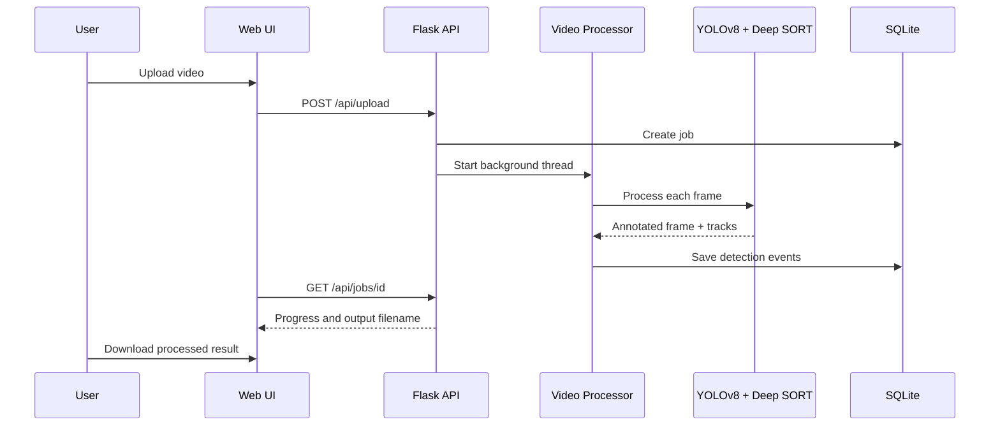
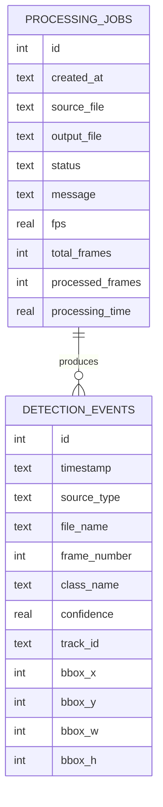

# AI-Based Real-Time Object Detection and Tracking System

A complete Flask portfolio project for real-time object detection and multi-object tracking using Python, OpenCV, YOLOv8, Deep SORT, SQLite, Bootstrap 5, and Chart.js.

## Features

- Live webcam detection streamed directly in the browser.
- Uploaded MP4, AVI, and MOV video processing in a background thread.
- YOLOv8 COCO detection for people, vehicles, animals, electronics, bottles, and many other classes.
- Deep SORT tracking IDs with short occlusion recovery support through `max_age`.
- Annotated bounding boxes with class name, confidence score, and tracking ID.
- Dashboard metrics for total detections, object counts by class, FPS, processing time, active tracks, and confidence.
- Screenshot capture, processed video download, and CSV detection log export.
- SQLite detection history with timestamps, filenames, class names, confidence scores, tracking IDs, and boxes.
- CUDA acceleration when PyTorch detects a compatible GPU; CPU fallback otherwise.
- Friendly handling for missing webcam, unsupported formats, corrupted videos, missing weights, and low memory.

## Folder Structure

```text
ObjectDetectionTracking/
  app/
    routes/              Flask page routes and JSON/streaming API endpoints
    services/            YOLO detection, camera streaming, upload processing
    tracking/            Deep SORT adapter and fallback tracker
    utils/               SQLite and file helpers
    config.py            Project configuration
  database/              SQLite database files
  docs/                  Extra documentation assets
  logs/                  CSV exports
  models/                Optional model weights folder
  processed/             Processed videos and screenshots
  static/
    css/                 Bootstrap overrides and dashboard styling
    js/                  Upload polling, charts, live controls
  templates/             Flask/Jinja pages
  uploads/               Uploaded source videos
  main.py                Flask entry point
  requirements.txt       Python dependencies
  yolov8n.pt             Default YOLOv8 model weight
```

## Installation

```bash
python -m venv venv
venv\Scripts\activate
pip install -r requirements.txt
python main.py
```

Open `http://127.0.0.1:5000`.

If you want a stronger model, place another YOLOv8 weight file in `models/` and update `Config.DEFAULT_MODEL_PATH` in `app/config.py`.

## Project Screenshots

Add final portfolio screenshots in `docs/screenshots/` after running the app:

| Page | Suggested Screenshot |
|---|---|
| Home | Animated hero and feature cards |
| Live Camera Detection | Browser stream with boxes, labels, scores, and IDs |
| Upload Video | Upload form with progress bar |
| Detection Results | Recent history table and CSV export |
| Analytics Dashboard | Metrics and Chart.js visualizations |

Recommended filenames: `home.png`, `live_detection.png`, `upload_progress.png`, `results.png`, and `dashboard.png`.

## API Endpoints

| Endpoint | Method | Purpose |
|---|---:|---|
| `/api/health` | GET | Check model readiness, device, and startup errors |
| `/api/upload` | POST | Upload and start processing a video |
| `/api/jobs/<job_id>` | GET | Poll upload processing progress |
| `/api/live_feed` | GET | Browser MJPEG webcam stream |
| `/api/camera/stop` | POST | Stop the webcam stream |
| `/api/screenshot` | POST | Save a processed webcam screenshot |
| `/api/download/<filename>` | GET | Download processed video |
| `/api/analytics` | GET | Retrieve dashboard metrics |
| `/api/history` | GET | Retrieve detection history |
| `/api/export/csv` | GET | Download detection history as CSV |

## Architecture Diagram



## Workflow Diagram



## Use Case Diagram



## Sequence Diagram



## ER Diagram



## Database Schema

`detection_events` stores one row per tracked detection: timestamp, source type, uploaded filename, frame number, class, confidence, tracking ID, and bounding box.

`processing_jobs` stores one row per upload: source file, output file, status, message, FPS, total frames, processed frames, and processing time.

## Detection Pipeline

1. OpenCV captures a BGR frame from webcam or video file.
2. `DetectionService._detect()` passes the frame to YOLOv8 with confidence and IoU thresholds.
3. YOLO returns bounding boxes in `xyxy`, class IDs, and confidence scores.
4. Detections are normalized into dictionaries with `bbox`, `confidence`, and `class_name`.
5. `ObjectTracker.update()` converts detections into Deep SORT format: `[x, y, width, height]`, confidence, and class.
6. Deep SORT predicts track motion with a Kalman filter and associates new detections using matching logic. Its `max_age` setting lets an object disappear briefly and still recover its ID when it reappears.
7. `DetectionService._draw()` annotates the frame with colored boxes, class labels, confidence, and ID.
8. Events are stored in SQLite and dashboard metrics are updated.

If `deep-sort-realtime` is unavailable, the project uses a small class-aware IoU fallback tracker so the UI can still run, but the recommended portfolio configuration is the real Deep SORT package.

## File and Function Explanation

- `main.py`: starts the Flask development server.
- `app/__init__.py`: creates the Flask app, registers blueprints, creates folders, and initializes SQLite.
- `app/config.py`: stores paths, upload extensions, YOLO thresholds, camera index, and runtime folders.
- `app/routes/pages.py`: renders Home, About, Live, Upload, Results, Dashboard, and Contact pages.
- `app/routes/api.py`: exposes upload, live stream, dashboard, history, CSV, screenshot, and download APIs.
- `app/services/detector.py`: loads YOLOv8, chooses CUDA or CPU, runs detection, updates tracking, draws labels, and calculates FPS.
- `app/services/camera.py`: captures webcam frames in a background thread and yields MJPEG frames to the browser.
- `app/services/video_processor.py`: processes uploaded files in a daemon thread, writes annotated MP4 output, and updates progress.
- `app/tracking/deepsort_tracker.py`: wraps Deep SORT and normalizes track outputs for the rest of the app.
- `app/utils/database.py`: creates tables, inserts detections, tracks jobs, aggregates analytics, and exports CSV logs.
- `app/utils/files.py`: validates upload extensions and creates safe unique filenames.
- `templates/*.html`: Bootstrap 5 pages.
- `static/js/app.js`: calls APIs, polls job status, renders Chart.js graphs, toggles theme, and controls live streaming.
- `static/css/styles.css`: responsive dashboard, cards, live stream shell, and animations.

## Deployment Guide

For a simple server deployment:

```bash
pip install -r requirements.txt
pip install gunicorn
gunicorn "app:create_app()" --bind 0.0.0.0:5000 --workers 1 --threads 4
```

Use one worker for webcam access because multiple workers may compete for the same camera. For production, set a stronger `SECRET_KEY`, place uploads on persistent storage, put Nginx in front of Flask, and run background video processing with a task queue if many users will upload at the same time.

## Interview Explanation

This project demonstrates an end-to-end computer vision system. YOLOv8 handles object detection because it is fast and pretrained on COCO classes. Deep SORT handles temporal identity by linking detections across frames using motion prediction and appearance features. Flask exposes both human-facing pages and machine-friendly APIs. OpenCV manages frame capture and video writing. SQLite keeps the project lightweight while still showing database design, analytics, and export capability.

The strongest points to explain in a viva are the difference between detection and tracking, why tracking IDs can survive short occlusion, how FPS is measured, why CUDA improves inference speed, how upload processing stays responsive through threading, and how frontend charts receive live analytics through JSON APIs.
